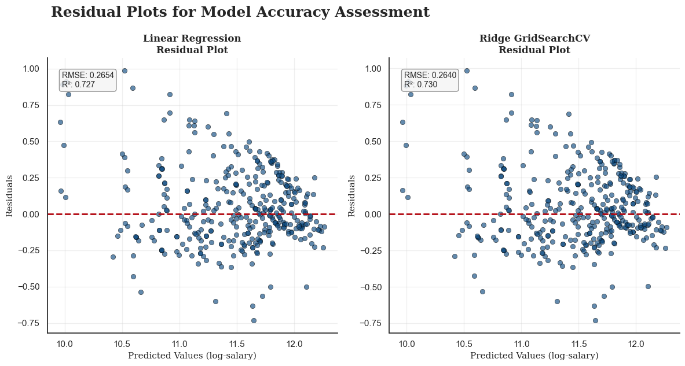
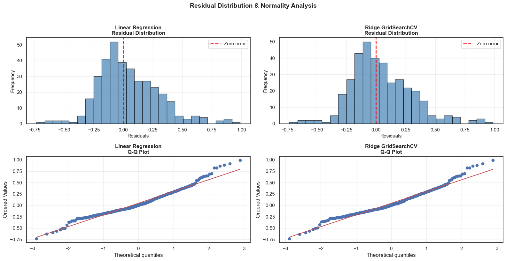

# Salary Prediction Model (Regression)

## Project Overview

This project builds a machine learning model to predict employee salaries from demographic and professional attributes such as age, gender, education, job title, and experience.
It demonstrates an end-to-end regression workflow that includes data cleaning, feature engineering, model training, evaluation, and deployment-ready preprocessing pipelines.

## What This Project Shows

- Real-world tabular data preprocessing, including missing value handling, duplicate removal, and skewed feature transformation.
- Reusable scikit-learn pipelines for numerical and categorical features.
- Model comparison between Linear Regression and Ridge Regression with GridSearchCV.
- Evaluation using MAE, RMSE, R², and residual analysis.

## Dataset and Features

- Final dataset size: 1,792 unique records after removing duplicates from the original 6,704 rows.
- Target variable: Annual salary in USD.
- Main input features: Age, Experience, Gender, Education level, and Job title.

Preprocessing steps:

- Missing values imputed using median for numeric features and most frequent value for categorical features.
- Log1p transformation applied to Salary and Experience to reduce right skew.
- Standard scaling used for numeric features, with one-hot and ordinal encoding for categorical variables.

## Models and Performance

| Model | MAE | RMSE | MSE | R²
|---|---:|---:|---:|---|
| Linear Regression | 0.200 | 0.265 | 0.070 | 0.727
| Ridge Regression (GridSearchCV) | 0.199 | 0.264 | 0.070 |  0.730

Linear Regression is the preferred model because it performs slightly better on the test set and is easier to explain to non-technical stakeholders.
Ridge Regression adds regularization, but it does not produce a meaningful improvement for this dataset.

## Analysis Visualizations

### 1. Missing Value Bar Chart

This chart highlights the percentage or count of missing values across all features before imputation.


### 2. Demographic Analysis: Top Categories

This visualization summarizes the most frequent categories across key demographic features such as gender, education, and job title.


### 3. Bivariate Analysis: Demographics vs Target Salary

This plot shows how salary varies across demographic categories and helps identify category-level salary trends.


### 4. Numerical Distribution Analysis

This figure presents the distribution of numerical features such as salary, age, and experience to assess skewness and spread.


### 5. Anomalies & Outlier (IQR Method)

This chart identifies outliers in numerical variables using the Interquartile Range method.


### 6. Data Deduplication Impact on Target Variable

This visualization compares salary distribution before and after duplicate removal to show the effect of data deduplication.


### 7. Linear Correlation Matrix

This heatmap shows pairwise correlations among numerical features and helps detect multicollinearity.


### 8. Residual Plots for Model Accuracy Assessment

Residual scatter plots are used to evaluate prediction error patterns and overall model fit.




### 9. Residual Distribution & Normality Analysis

This figure evaluates whether model residuals are approximately normally distributed using histograms and Q-Q plots.




## Tech Stack

- Python and Jupyter Notebook
- pandas and numpy for data handling and feature engineering.[3][4]
- scikit-learn for preprocessing, pipelines, regression models, and GridSearchCV.[3]
- matplotlib and seaborn for EDA and diagnostic visualizations.[4]
- scipy for statistical testing during residual analysis.[4]

## Quick Start

```bash
git clone <your-repo-url>
cd Salary_Prediction

python -m venv venv
# Linux/macOS
source venv/bin/activate
# Windows
venv\Scripts\activate

pip install -r requirements.txt
```

Run the notebook or script to preprocess the data, train the models, evaluate results, and generate salary predictions.