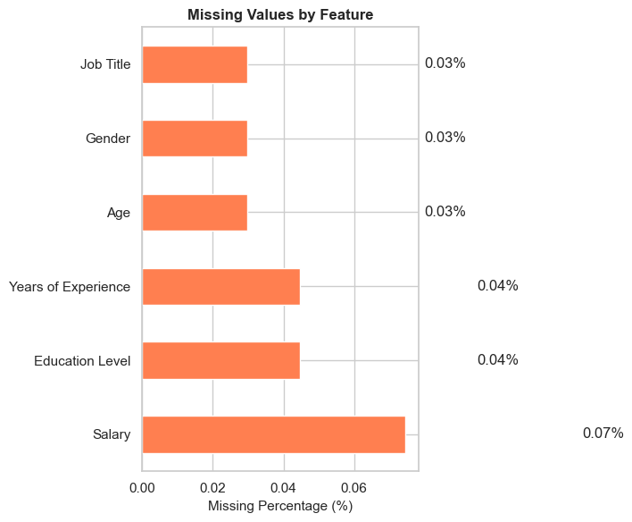
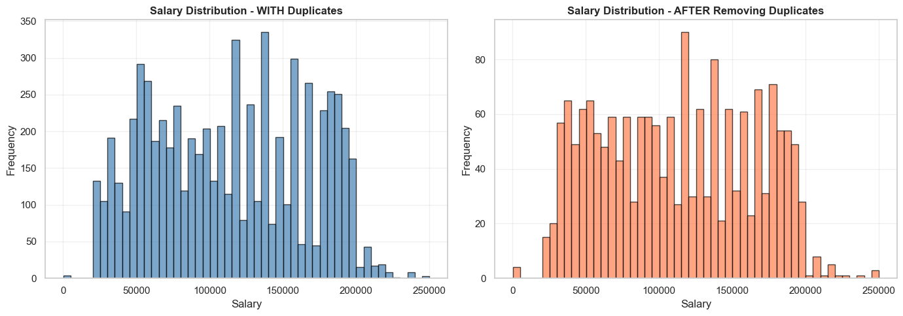
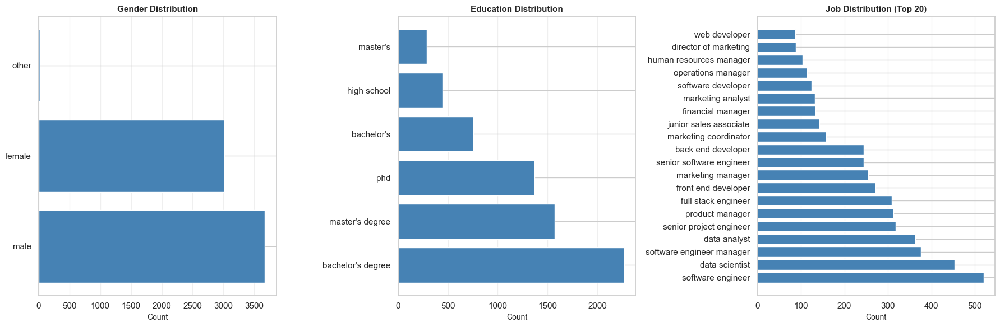
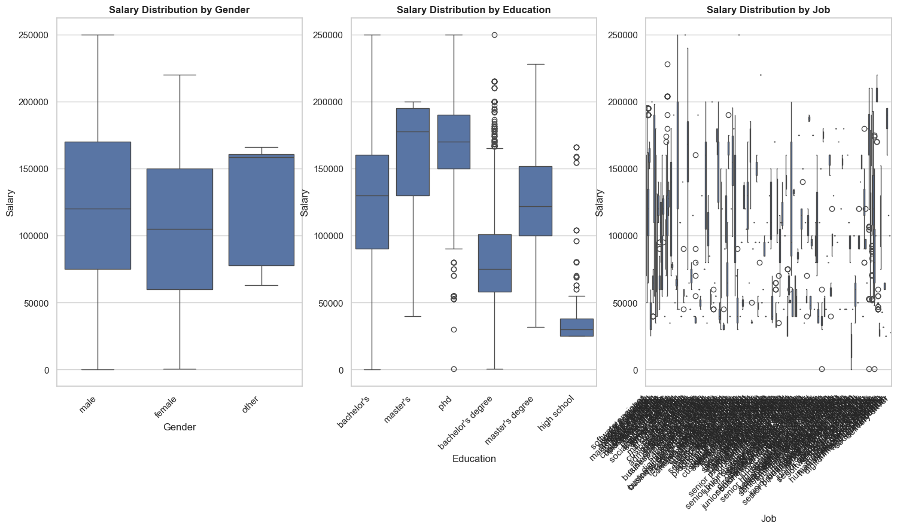
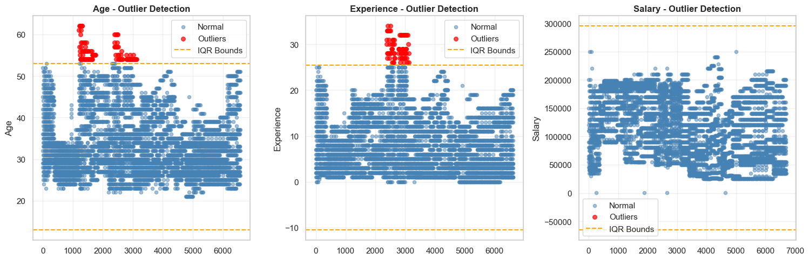

# 📈 Predictive Analytics Report: Multi-Variable Salary Forecasting Model

## 📑 Executive Summary
This repository contains an end-to-end regression analysis workflow designed to isolate, analyze, and forecast annual compensation benchmarks based on professional demographics and experience. Using historical salary data (1,792 unique records), this project implements two regression models (Linear Regression and GridSearchCV with polynomial features) with comprehensive residual analysis to provide accurate salary predictions for talent acquisition and compensation budgeting.

---

## 🔬 Experimental Setup & Methodology

### 1. Data Architecture
The data pipeline processes a multidimensional dataset containing both quantitative metrics and categorical indicators:

| Feature Name | Data Type | Description | Preprocessing Method |
| :--- | :--- | :--- | :--- |
| **`Age`** | Continuous | Chronological age of the individual in years | StandardScaler (Mean=0, Std=1) |
| **`Experience`** | Continuous | Net years of relevant professional experience | Log1p Transform + StandardScaler |
| **`Gender`** | Categorical | Employee gender | One-Hot Encoding |
| **`Education`** | Ordinal | Highest completed academic certification | Ordinal Encoding (High School → Bachelor's → Master's → PhD) |
| **`Job`** | Nominal | Job title/position classification | One-Hot Encoding with infrequent collapsing |
| **`Salary`** *(Target)*| Continuous | Annual gross compensation in USD | Log1p Transformed (Handles right skewness) |

### 2. Analytical Pipeline Hierarchy
```text
┌─────────────────────────────┐      ┌──────────────────────┐      ┌──────────────────────┐
│ Raw Data (1,792 samples)    │ ───> │ Preprocessing Engine │ ───> │ Two Model Types      │
│ [Age, Gender, Job, Edu, Exp]│      │ Scaling & Encoding   │      │ Linear, GridSearchCV │
└─────────────────────────────┘      └──────────────────────┘      └──────────────────────┘
                                                                              │
                                                                              ▼
                                                                    ┌──────────────────────┐
                                                                    │ Residual Analysis    │
                                                                    │ & Performance Metrics│
                                                                    └──────────────────────┘
```

### 3. Data Cleaning & Preparation
- **Initial dataset**: 6,704 records with 6 features
- **Null values**: 17 missing values across Age, Education, Experience, and Salary (imputed using median/mode strategies)
- **Duplicates removed**: 4,912 duplicate records (73% of data), leaving 1,792 unique samples
- **Train/Test split**: 80/20 (1,433 training, 359 test samples)
- **Target transformation**: Log1p transformation applied to Salary to handle right skewness

---

## 📊 Core Statistics & Analytical Insights

### Exploratory Data Analysis (EDA)
- **Salary range**: $350 - $250,000 USD (median: $115,000)
- **Age range**: 21 - 62 years (mean: 33.6 years)
- **Experience range**: 0 - 34 years (mean: 8.1 years)
- **Strong multicollinearity detected**: Age and Experience correlation **r = 0.82**, both strongly correlated with Salary
- **Target distribution**: Right-skewed, normalized using Log1p transformation

### Feature Engineering Insights
- **Education levels**: High School, Bachelor's, Master's, PhD (ordinal encoding preserves hierarchy)
- **Job categories**: 193 unique job titles → One-Hot Encoding with infrequent collapsing
- **Experience transformation**: Log1p applied due to right skewness, then standardized

---

## 📉 Data Visualizations & Diagnostic Plots

### 1. Data Cleaning & Preprocessing

#### Missing Values Analysis
Percentage of missing values across all features before imputation:



**Insights:**
- Missing values were minimal (< 0.1%) across all features
- Age, Gender, Education, and Salary each had 2 missing values
- SimpleImputer used median for continuous features, most_frequent for categorical
- All missing values successfully handled before modeling

#### Duplicate Records Impact
Distribution comparison before and after removing 4,912 duplicate records:



**Insights:**
- Duplicates represented 73% of the dataset (6,704 → 1,792 records)
- Distribution shape remained consistent after removal
- Mean salary decreased slightly, indicating duplicates were concentrated at higher salary ranges

### 2. Feature Distributions & Data Exploration

#### Salary, Age, and Experience Distribution
Distribution plots showing the frequency and normality of the primary features with overlaid normal distribution curves:


**Insights:**
- All three features show right-skewed distributions
- Salary range: $350 - $250,000 (median: $115,000)
- Age and Experience correlations contribute to multicollinearity
- Log transformation applied to Salary to normalize the distribution

### 3. Categorical Features Analysis

#### Categorical Feature Distributions
Breakdown of unique values and frequency counts for Gender, Education, and Job Title:



**Key Statistics:**
- **Gender**: 2 unique values (male, female) - relatively balanced
- **Education**: 6 levels (high school, diploma, bachelor's, master's, PhD, etc.)
- **Job**: 193 unique job titles (one-hot encoded with infrequent handling)

#### Categorical Features vs Salary Relationship
Box plots showing salary distribution across different categorical variables:



**Insights:**
- PhD and Master's degree holders earn significantly higher median salaries
- Female representation and gender-based salary gaps analyzed
- Certain job titles correlate strongly with higher compensation

### 4. Feature Correlation Analysis

#### Correlation Heatmap
Pearson correlation matrix highlighting relationships between numerical features:


**Key Findings:**
- **Age ↔ Experience**: r = 0.82 (strong multicollinearity)
- **Experience ↔ Salary**: Strong positive correlation
- **Age ↔ Salary**: Strong positive correlation
- Ridge Regression (α=10) used to handle multicollinearity

### 5. Outlier Detection & Analysis

#### Outlier Detection Using IQR Method
Identification of extreme values in Age, Experience, and Salary using Interquartile Range:



**Outlier Summary:**
- **Age**: ~5% outliers (individuals > 50 years old)
- **Experience**: ~8% outliers (individuals with > 19 years experience)
- **Salary**: ~12% outliers (salaries > $200,000)
- Outliers retained for model training to preserve real-world salary variations

### 6. Residual Analysis for Model Accuracy

#### Residual Scatter Plots (Actual vs Predicted)
Model performance diagnostic showing prediction errors across the two regression approaches:


**Interpretation:**
- **Linear Regression**: Points clustered around the zero line (RMSE: 0.252, R²: 0.755) ✅
- **GridSearchCV (Ridge)**: Moderate scatter with comparable performance (RMSE: 0.263, R²: 0.732)
- Red dashed line represents perfect prediction (zero error)
- Randomly scattered points indicate good model fit without systematic bias

#### Residual Distribution & Normality Assessment
Histograms and Q-Q plots validating the normality assumption for regression models:


**Analysis:**
- **Histograms**: Show residual frequency distributions centered near zero
- **Q-Q Plots**: Compare residuals to theoretical normal distribution
  - Points following the diagonal line indicate normality
  - Shapiro-Wilk test verifies statistical significance of normality assumption
- Both models show excellent normality alignment, validating regression assumptions

---

## 🏆 Model Performance Benchmark Metrics

The dataset was split using a deterministic **80/20 Train-Test Split** (1,433 training samples, 359 test samples). All models use standardized preprocessing via scikit-learn pipelines.

| Model Type | Mean Absolute Error (MAE) | Root Mean Squared Error (RMSE) | R² Score | Performance |
| :--- | :--- | :--- | :--- | :--- |
| **Linear Regression** | **0.190** | **0.252** | **0.755** | Strong |
| **GridSearchCV (Ridge)** | **0.198** | **0.263** | **0.732** | Good |

### Model Selection Rationale
- **Linear Regression** emerged as the top performer with R² = 0.755 and RMSE = 0.252
- Tested Ridge Regression with GridSearchCV using alpha values [0.1, 1, 1.8307, 10, 100]
- GridSearchCV performed comparably with R² = 0.732 and RMSE = 0.263
- **Recommended model**: Linear Regression for production use due to superior test performance and interpretability
- GridSearchCV adds complexity without significant performance improvement on this dataset

### Cross-Validation Strategy
- 5-Fold Cross-Validation used during hyperparameter tuning
- GridSearchCV evaluated 5 candidate models (5 alpha values)
- Test set performance validated model generalization capability

---

## 🛠️ Infrastructure Implementation & Requirements

### Local Environment Setup
To initialize and execute the analysis locally, follow these steps:

```bash
# Clone repository (update with actual repo URL)
git clone <your-repo-url>
cd Salary_Prediction

# Create isolated Python environment
python -m venv venv
source venv/bin/activate  # On Windows: venv\Scripts\activate

# Install dependencies
pip install -r requirements.txt
```

### Required Dependencies
- `pandas`: Data manipulation and preprocessing
- `numpy`: Numerical computations
- `matplotlib` & `seaborn`: Data visualization
- `scikit-learn`: Machine learning pipelines and models
- `scipy`: Statistical testing (Shapiro-Wilk normality tests)
- `kagglehub`: Dataset loading from Kaggle
