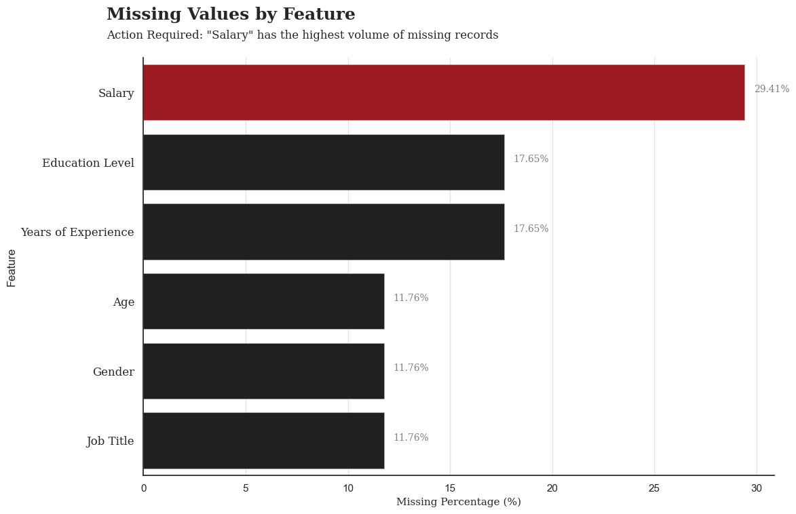
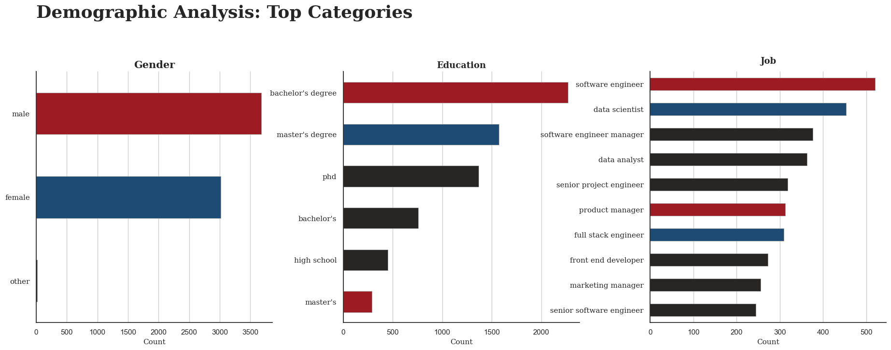
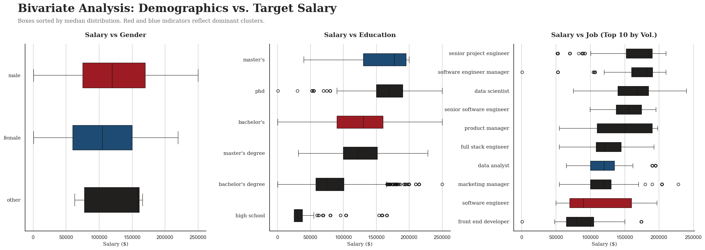
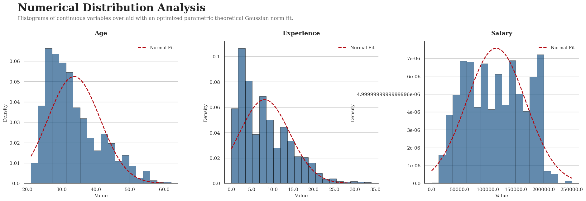
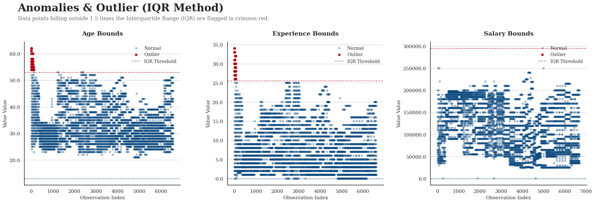
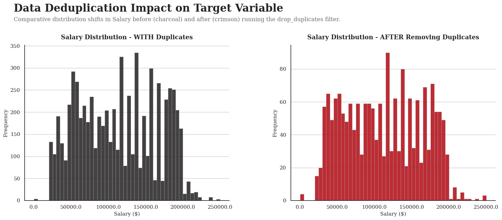
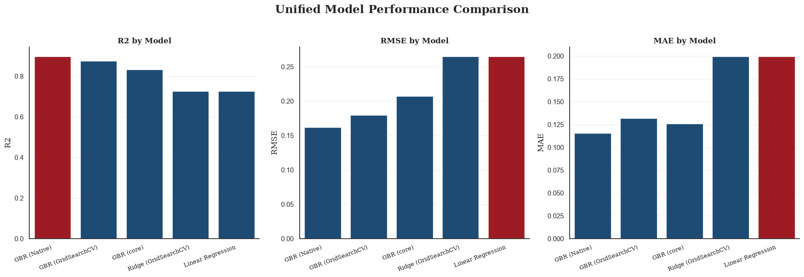
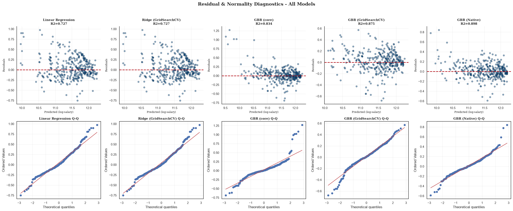

# Salary Prediction Model (Regression)

## Project Overview

This project builds a machine learning model to predict employee salaries from demographic and professional attributes such as age, gender, education, job title, and experience.
It demonstrates an end-to-end regression workflow that includes data cleaning, feature engineering, model training, evaluation, and deployment-ready preprocessing pipelines.

## What This Project Shows

- Real-world tabular data preprocessing, including missing value handling, duplicate removal, and skewed target transformation.
- Reusable scikit-learn pipelines for numerical and categorical features.
- A **unified model suite** comparing Linear Regression, Ridge (GridSearchCV), and three `HistGradientBoostingRegressor` (GBR) variants.
- Evaluation using MAE, RMSE, R², and residual analysis, plus permutation importance for explainability.
- A lightweight model registry (`model_registry.py`) to persist and reload the best estimator.

## Dataset and Features

- Final dataset size: 1,792 unique records after removing duplicates from the original 6,704 rows.
- Target variable: Annual salary in USD.
- Main input features: Age, Experience, Gender, Education level, and Job title.

Preprocessing steps:

- Missing values imputed using median for numeric features and most frequent value for categorical features.
- `log1p` transformation applied to the Salary target (and Experience) to reduce right skew before modeling.
- Standard scaling used for numeric features; categorical features encoded with ordinal encoders (with known category orders for Gender and Education), which also lets `HistGradientBoostingRegressor` treat them as native categoricals.

## Models and Performance

All models are built from a single shared preprocessor and trained/evaluated on the same 80/20 split of `log_salary` (metrics below are on the held-out test set). Five models make up the unified suite:

| Model | MAE | RMSE | MSE | R² |
|---|---:|---:|---:|---:|
| Linear Regression | 0.1998 | 0.2653 | 0.0704 | 0.7273 |
| Ridge Regression (GridSearchCV) | 0.1998 | 0.2652 | 0.0703 | 0.7273 |
| GBR (core) — `HistGradientBoostingRegressor` | 0.1258 | 0.2072 | 0.0429 | 0.8336 |
| GBR (Native) — HGBR w/ native categoricals | **0.1154** | **0.1618** | **0.0262** | **0.8985** |


**Outcome:** `GBR (Native)` is the best performer by a clear margin (R² ≈ 0.90, ~39% lower RMSE than the linear baselines) and is the model persisted to `models/best_gbr_native.joblib` for deployment. The simpler Linear/Ridge models remain useful as interpretable, low-latency baselines.

## Analysis Visualizations

### 1. Missing Value Bar Chart

This chart highlights the percentage or count of missing values across all features before imputation.




### 2. Demographic Analysis: Top Categories

This visualization summarizes the most frequent categories across key demographic features such as gender, education, and job title.




### 3. Bivariate Analysis: Demographics vs Target Salary

This plot shows how salary varies across demographic categories and helps identify category-level salary trends.




### 4. Numerical Distribution Analysis

This figure presents the distribution of numerical features such as salary, age, and experience to assess skewness and spread.




### 5. Anomalies & Outlier (IQR Method)

This chart identifies outliers in numerical variables using the Interquartile Range method.




### 6. Data Deduplication Impact on Target Variable

This visualization compares salary distribution before and after duplicate removal to show the effect of data deduplication.




### 7. Linear Correlation Matrix

This heatmap shows pairwise correlations among numerical features and helps detect multicollinearity.


### 8. Unified Model Performance Comparison

Bar charts comparing R², RMSE, and MAE across the entire model suite (linear baselines + GBR variants), with the best-scoring model on each metric highlighted.



### 9. Residual & Normality Diagnostics — All Models

A grid of predicted-vs-residual scatter plots and Q-Q plots, one column per model, used to assess homoscedasticity and residual normality across the suite.



### 10. Permutation Importance (GBR Native)

Horizontal bars showing each feature's permutation importance (drop in R² when shuffled), ranking the most influential inputs for the chosen model.

Permutation importance (GBR Native):
  Experience   1.7600 +/- 0.0706
  Job          0.2316 +/- 0.0142
  Age          0.0649 +/- 0.0071
  Education    0.0125 +/- 0.0027
  Gender       0.0014 +/- 0.0050


## Repository Structure

- `salary_prediction_model.ipynb` — end-to-end EDA + modeling notebook (Section 4 covers the unified model suite).
- `preprocessing_pipeline.py` — reusable preprocessor, model constructors (`linear_model_pipeline`, `ridge_gridCv_pipeline`, `gbr_pipeline`, `gbr_gridCv_pipeline`, `create_native_gbr_pipeline`), `evaluate_model`, `predict_salary`, and `load_training_data`.
- `model_registry.py` — `save_model` / `load_model` / `list_models` for persisting estimators to `models/`.
- `evaluate_extensions.py` — standalone script that re-runs the comparison, persists the best model, and prints permutation importance.
- `models/` — persisted estimators (e.g. `best_gbr_native.joblib`).
- `assets/` — figures referenced above.

## Tech Stack

- Python and Jupyter Notebook
- pandas and numpy for data handling and feature engineering.
- scikit-learn for preprocessing, pipelines, Linear/Ridge regression, `HistGradientBoostingRegressor`, `GridSearchCV`, and `permutation_importance`.
- matplotlib and seaborn for EDA and diagnostic visualizations.
- scipy for statistical testing (Q-Q plots) during residual analysis.
- joblib (via `model_registry.py`) for persisting trained estimators.

## Quick Start

```bash
git clone <your-repo-url>
cd Salary_Prediction

python -m venv venv

# Windows
venv\Scripts\activate

pip install -r requirements.txt   # or: pip install pandas numpy scikit-learn matplotlib seaborn scipy joblib kagglehub
```

Run the notebook or scripts to preprocess the data, train the model suite, evaluate results, and generate salary predictions:


## Predicting with the Saved Model

```python
from model_registry import load_model
from preprocessing_pipeline import predict_salary

model = load_model("best_gbr_native")   # returns models/best_gbr_native.joblib
# `records` is a DataFrame/records with columns: Age, Gender, Education, Experience, Job
predicted_usd = predict_salary(model, records)
```