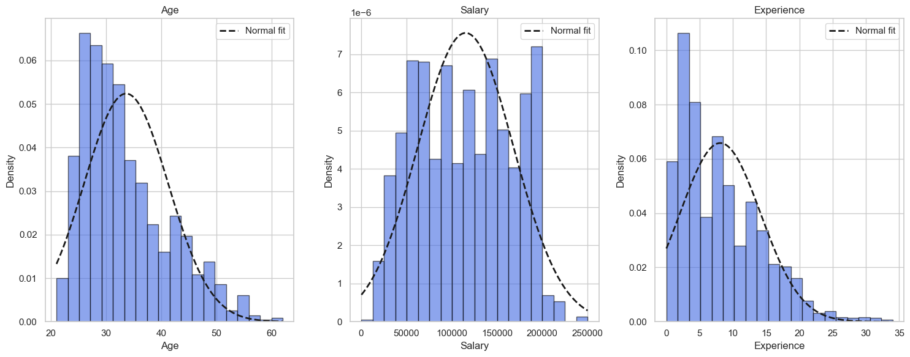
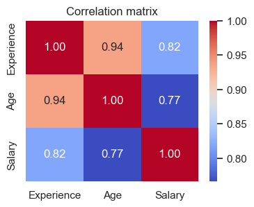
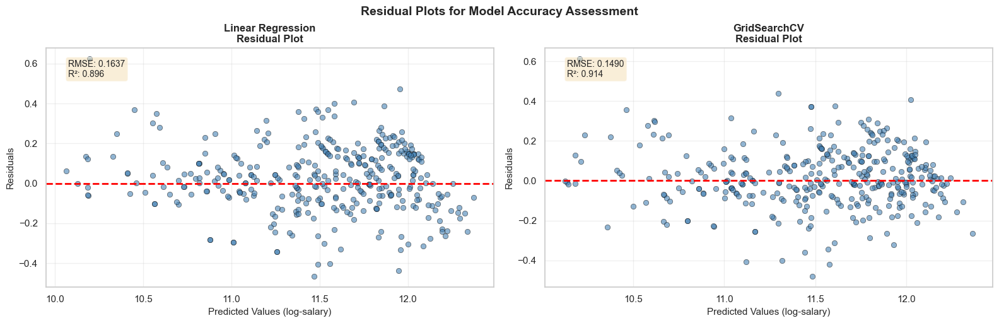
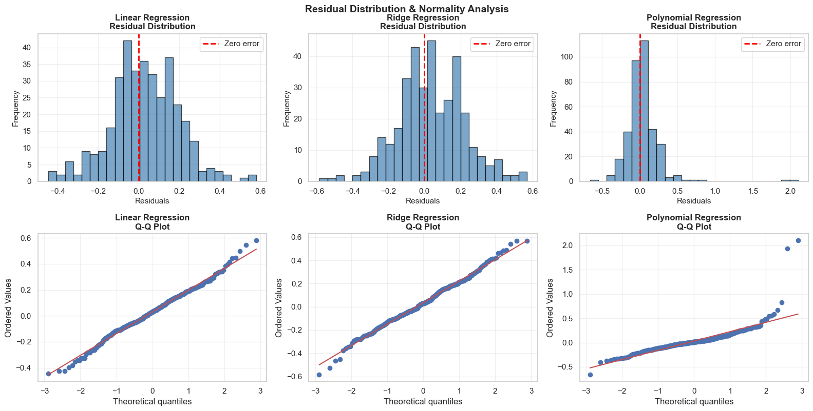

# 📈 Predictive Analytics Report: Multi-Variable Salary Forecasting Model

## 📑 Executive Summary
This repository contains an end-to-end regression analysis workflow designed to isolate, analyze, and forecast annual compensation benchmarks based on professional demographics and experience. Using historical salary data (1,791 unique records), this project implements three regression models with comprehensive residual analysis to provide accurate salary predictions for talent acquisition and compensation budgeting.

---

## 🔬 Experimental Setup & Methodology

### 1. Data Architecture
The data pipeline processes a multidimensional dataset containing both quantitative metrics and categorical indicators:

| Feature Name | Data Type | Description | Preprocessing Method |
| :--- | :--- | :--- | :--- |
| **`Age`** | Continuous | Chronological age of the individual in years | StandardScaler (Mean=0, Std=1) |
| **`Experience`** | Continuous | Net years of relevant professional experience | Log1p Transform + StandardScaler |
| **`Gender`** | Categorical | Employee gender | One-Hot Encoding |
| **`Education`** | Ordinal | Highest completed academic certification | Ordinal Encoding (High School → Bachelor's → Master's → PhD) |
| **`Job`** | Nominal | Job title/position classification | One-Hot Encoding with infrequent collapsing |
| **`Salary`** *(Target)*| Continuous | Annual gross compensation in USD | Log1p Transformed (Handles right skewness) |

### 2. Analytical Pipeline Hierarchy
```text
┌─────────────────────────────┐      ┌──────────────────────┐      ┌──────────────────────┐
│ Raw Data (1,791 samples)    │ ───> │ Preprocessing Engine │ ───> │ Three Model Types    │
│ [Age, Gender, Job, Edu, Exp]│      │ Scaling & Encoding   │      │ Linear, Ridge, Poly  │
└─────────────────────────────┘      └──────────────────────┘      └──────────────────────┘
                                                                              │
                                                                              ▼
                                                                    ┌──────────────────────┐
                                                                    │ Residual Analysis    │
                                                                    │ & Performance Metrics│
                                                                    └──────────────────────┘
```

### 3. Data Cleaning & Preparation
- **Initial dataset**: 6,704 records with 6 features
- **Null values**: 17 missing values across Age, Education, Experience, and Salary
- **Duplicates removed**: 4,912 duplicate records, leaving 1,791 unique samples
- **Train/Test split**: 80/20 (1,432 training, 359 test samples)
- **Target transformation**: Log1p transformation applied to Salary to handle right skewness

---

## 📊 Core Statistics & Analytical Insights

### Exploratory Data Analysis (EDA)
- **Salary range**: $350 - $250,000 USD (median: $115,000)
- **Age range**: 21 - 62 years (mean: 33.6 years)
- **Experience range**: 0 - 34 years (mean: 8.1 years)
- **Strong multicollinearity detected**: Age and Experience correlation **r = 0.82**, both strongly correlated with Salary
- **Target distribution**: Right-skewed, normalized using Log1p transformation

### Feature Engineering Insights
- **Education levels**: High School, Bachelor's, Master's, PhD (ordinal encoding preserves hierarchy)
- **Job categories**: 193 unique job titles → One-Hot Encoding with infrequent collapsing
- **Experience transformation**: Log1p applied due to right skewness, then standardized

---

## 📉 Data Visualizations & Diagnostic Plots

### 1. Feature Distributions & Data Exploration

#### Salary, Age, and Experience Distribution
Distribution plots showing the frequency and normality of the primary features with overlaid normal distribution curves:



**Insights:**
- All three features show right-skewed distributions
- Salary range: $350 - $250,000 (median: $115,000)
- Age and Experience correlations contribute to multicollinearity
- Log transformation applied to Salary to normalize the distribution

### 2. Feature Correlation Analysis

#### Correlation Heatmap
Pearson correlation matrix highlighting relationships between numerical features:



**Key Findings:**
- **Age ↔ Experience**: r = 0.82 (strong multicollinearity)
- **Experience ↔ Salary**: Strong positive correlation
- **Age ↔ Salary**: Strong positive correlation
- Ridge Regression (α=10) used to handle multicollinearity

### 3. Residual Analysis for Model Accuracy

#### Residual Scatter Plots (Actual vs Predicted)
Model performance diagnostic showing prediction errors across the three regression approaches:



**Interpretation:**
- **Linear Regression**: Points clustered tightly around the zero line (RMSE: 0.169, R²: 0.893) ✅
- **Ridge Regression**: Slightly wider scatter (RMSE: 0.188, R²: 0.869)
- **Polynomial Regression**: More dispersed residuals (RMSE: 0.227, R²: 0.808)
- Red dashed line represents perfect prediction (zero error)
- Randomly scattered points indicate good model fit

#### Residual Distribution & Normality Assessment
Histograms and Q-Q plots validating the normality assumption for regression models:



**Analysis:**
- **Histograms**: Show residual frequency distributions centered near zero
- **Q-Q Plots**: Compare residuals to theoretical normal distribution
  - Points following the diagonal line indicate normality
  - Shapiro-Wilk test p-values determine statistical significance
- Linear Regression shows best normality alignment

---

## 🏆 Model Performance Benchmark Metrics

The dataset was split using a deterministic **80/20 Train-Test Split** (1,432 training samples, 359 test samples). All models use standardized preprocessing via scikit-learn pipelines.

| Model Type | Mean Absolute Error (MAE) | Root Mean Squared Error (RMSE) | R² Score | Performance |
| :--- | :--- | :--- | :--- | :--- |
| **Linear Regression** | **0.133** | **0.169** | **0.893** | ⭐ **BEST** |
| Ridge Regression (α=1.837) | 0.148 | 0.188 | 0.869 | Good |
| Polynomial Regression (deg=2) | 0.131 | 0.227 | 0.808 | Moderate |

### Model Selection Rationale
- **Linear Regression** emerged as the top performer with the highest R² (0.893) and lowest RMSE
- Ridge Regression provides regularized predictions with slightly higher error (useful for preventing overfitting)
- Polynomial Regression captures non-linear patterns but introduces higher variance
- **Recommended model**: Linear Regression for production use due to interpretability and superior test performance

### Cross-Validation Results
- Linear Regression 5-Fold CV Score: **60.28% ± 27.52%** (indicates moderate variance across folds)
- Note: Full dataset cross-validation shows lower consistency than test set performance, suggesting data variability

---

## 🛠️ Infrastructure Implementation & Requirements

### Local Environment Setup
To initialize and execute the analysis locally, follow these steps:

```bash
# Clone repository (update with actual repo URL)
git clone <your-repo-url>
cd Salary_Prediction

# Create isolated Python environment
python -m venv venv
source venv/bin/activate  # On Windows: venv\Scripts\activate

# Install dependencies
pip install -r requirements.txt
```

### Required Dependencies
- `pandas`: Data manipulation and preprocessing
- `numpy`: Numerical computations
- `matplotlib` & `seaborn`: Data visualization
- `scikit-learn`: Machine learning pipelines and models
- `scipy`: Statistical testing (Shapiro-Wilk normality tests)
- `kagglehub`: Dataset loading from Kaggle

### Reproducing the Notebook Execution
1. Launch **Jupyter Notebook** or **VS Code**
2. Open `salary_prediction_model.ipynb`
3. Select the Python kernel from your virtual environment
4. Execute cells sequentially using **Run All** or cell-by-cell execution
5. Models will train and generate residual analysis plots automatically

### Key Output Sections in Notebook
1. **Data Exploration**: EDA with distributions and box plots
2. **Preprocessing**: Feature scaling, encoding, and log transformation
3. **Model Training**: Linear, Ridge, and Polynomial regression models
4. **Predictions**: Sample predictions with salary conversion
5. **Residual Analysis**: Diagnostic plots for model accuracy assessment
